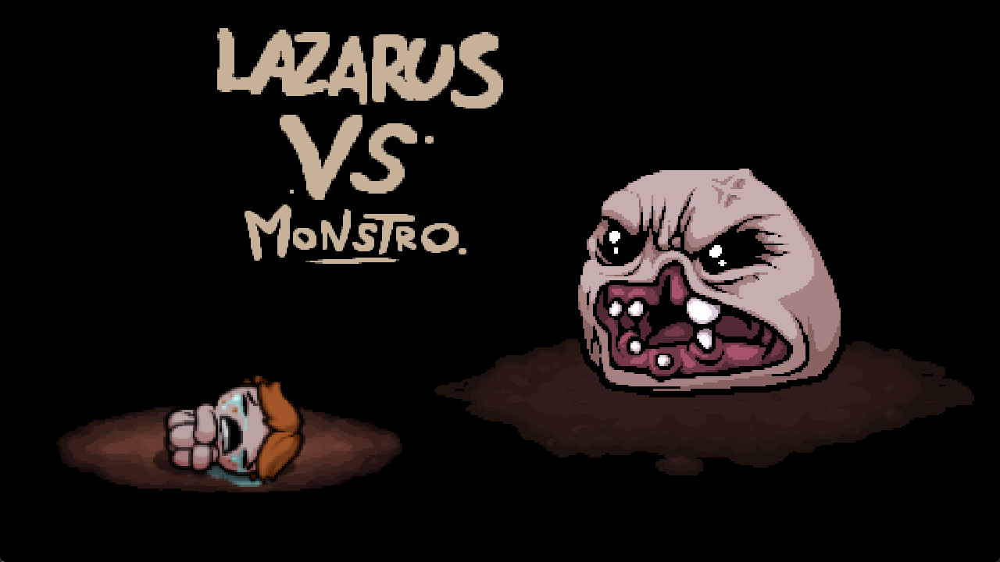

# Dungeon Game in Python
Game made with pygame, inspired by The Binding of Isaac

Project made by Mateusz Bobula and Jakub Konopka for python lectures at AGH UST 2023/24


# Usage
### Windows
```sh
python -m venv venv
```

```sh
.\venv\Scripts\activate
```

```sh
pip install -r requirements.txt
```

### Linux/MacOS
```sh
python -m venv venv
```

```sh
source venv/bin/activate
```

```sh
pip install -r requirements.txt
```

# Running the game

```sh
cd ./src
```

```sh
python ./main.py
```

# Controls
<kbd>&uarr;</kbd>
<kbd>&darr;</kbd>
<kbd>&larr;</kbd>
<kbd>&rarr;</kbd> - movement <br/>

<kbd>W</kbd>
<kbd>S</kbd>
<kbd>A</kbd>
<kbd>D</kbd> - shooting <br/>

<kbd>E</kbd> - place bomb <br/>

<kbd>Space</kbd> - pick up item / enter new level <br/>

<kbd>Enter</kbd> - select menu element <br/>

<kbd>Esc</kbd> - go back in menu <br/>

# Screenshots





